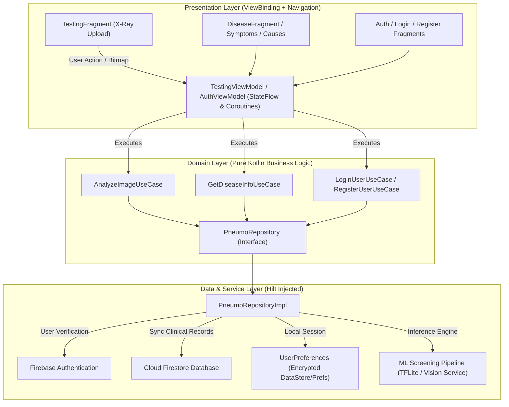
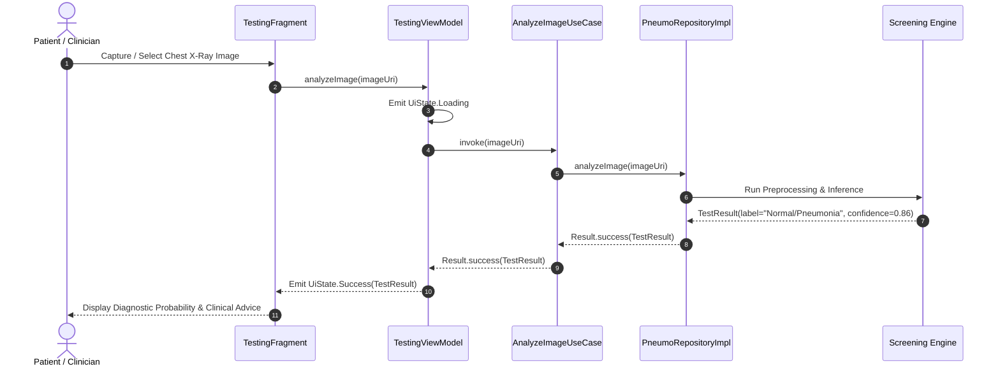

# 🫁 PneumoScan — AI-Assisted Pneumonia Screening & Clinical Reference

[](https://developer.android.com)
[](https://kotlinlang.org/)
[](https://developer.android.com/topic/architecture)
[](https://dagger.dev/hilt/)
[](https://firebase.google.com/)
[](LICENSE)

> **PneumoScan** is a production-engineered Android medical diagnostic & educational platform designed to streamline chest radiography screening, facilitate early pneumonia triage, and provide accessible clinical guidelines for respiratory conditions.

---

## 📖 Overview

Pneumonia remains one of the leading infectious causes of mortality worldwide, particularly among vulnerable pediatric and geriatric populations. Early, accurate triage and accessible clinical guidance are critical for preventing complications.

**PneumoScan** is built from the ground up on modern **Android Clean Architecture** and **MVVM** principles. It pairs a clinical respiratory reference knowledge base with an extensible image analysis pipeline for chest X-ray screening. By integrating secure cloud authentication, local user caching, and a modular domain use-case layer, PneumoScan delivers a robust, testable, and maintainable mobile healthcare solution.

---

## 🏗️ Architecture & Data Flow

PneumoScan adheres strictly to **Clean Architecture** with unidirectional data flow (UDF) across Presentation, Domain, and Data layers:



### Chest Radiography Screening Sequence



---

## ✨ Core Features

- 🔬 **Chest Radiography Screening Pipeline**: Modular `AnalyzeImageUseCase` and `TestingViewModel` supporting image capture, URI handling, and diagnostic confidence scoring.
- 📚 **Comprehensive Respiratory Knowledge Base**: Curated medical guides detailing bacterial vs. viral pneumonia etiology, pathology, risk factors, and recommended interventions.
- 🔐 **Secure Firebase Authentication**: Built-in email/password authentication with automated Firestore document provisioning for patient profile state management.
- 💉 **Symptom & Medication Directory**: Structured clinical reference covering acute symptoms (dyspnea, cough, fever) and pharmacological guidance (antibiotics, antivirals, supportive care).
- 💉 **Dependency Injection with Dagger Hilt**: Fully decoupled architecture featuring `@HiltAndroidApp`, modular repository providers, and constructor-injected use cases.
- 🎨 **Material 3 Design System**: ViewBinding-driven layouts with custom gradient drawables, fluid transitions, and responsive Bottom Navigation routing.

---

## 📱 Key Screens & Modules

| Module / Screen | Primary Purpose | Implementation Highlights |
|---|---|---|
| **`SplashActivity` & `MainActivity`** | Application bootstrap & root navigation host | Implements Jetpack Navigation Host with dynamic BottomNavigationView synchronization |
| **`LoginFragment` & `RegisterFragment`** | User authentication & credential validation | `AuthViewModel`, Form validation (`ValidationUtils`), Firebase Auth & Firestore sync |
| **`HomeFragment`** | Central clinical dashboard & quick-action hub | Card-based entry points for screening, disease index, symptoms, and prevention |
| **`TestingFragment`** | Chest X-ray image ingestion & diagnosis viewer | Gallery / Camera intent integration, Coil image rendering, confidence percentage gauges |
| **`DiseaseFragment`** | In-depth pathology & clinical distinction viewer | Tabulated comparison of Bacterial, Viral, and Atypical pneumonia syndromes |
| **`SymptomsFragment`** | Clinical triage checklist | Categorized diagnostic indicators for respiratory assessment |
| **`MedicationFragment`** | Pharmacotherapy & care guidelines | Reference guide for first-line therapies, antiviral regimens, and supportive protocols |
| **`AboutUsFragment`** | Educational accreditation & app metadata | Developer attribution, clinical disclaimer, and open-source licensing details |

---

## 🛠️ Technology Stack

| Layer / Component | Technology / Library | Version | Purpose |
|---|---|---|---|
| **Language** | Kotlin | `2.0.21` | Modern, type-safe Android development |
| **Target SDK** | Android SDK 36 (UpsideDownCake+) | Min SDK `24` | Modern Android platform APIs |
| **Build Tool** | Android Gradle Plugin (AGP) | `8.13.0` | Gradle Kotlin DSL (`.gradle.kts`) |
| **UI Framework** | ViewBinding + Material Components | `1.13.0` | Declarative XML layout binding & Material 3 widgets |
| **Navigation** | AndroidX Navigation Component | `2.9.5` | Single-Activity fragment navigation & deep linking |
| **Dependency Injection** | Dagger Hilt | `2.57.2` | Clean dependency injection with Kapt |
| **Asynchronous Engine** | Kotlinx Coroutines & Flow | `1.10.2` | Non-blocking background thread execution |
| **Image Loading** | Coil | `2.7.0` | Fast, lightweight asynchronous image decoding |
| **Authentication** | Firebase Auth | `24.0.1` | Cloud identity & access management |
| **Cloud Database** | Firebase Cloud Firestore | `26.0.2` | Real-time user profile & screening data sync |
| **Network & REST** | Retrofit 2 + Gson Converter | `3.0.0` | Extensible REST API interface for remote inference |
| **Local Persistence** | AndroidX Room & SharedPrefs | `2.8.2` | Local caching of clinical data & offline sessions |

---

## 🚀 Getting Started

### Prerequisites

- **Android Studio Ladybug (2024.2.1+)** or newer.
- **JDK 17 or JDK 21** configured in Android Studio.
- **Android Device or Emulator** running Android API 24 (Nougat) or higher.
- A **Firebase Project** with Authentication (Email/Password) and Cloud Firestore enabled.

### Firebase Configuration Setup

1. Copy the example Firebase configuration file:
   ```bash
   cp app/google-services.json.example app/google-services.json
   ```
2. Replace the placeholder values in `app/google-services.json` with your real Firebase Project credentials downloaded from the [Firebase Console](https://console.firebase.google.com/).

### Build & Execution

1. Clone the repository:
   ```bash
   git clone https://github.com/shayann07/PneumoScan.git
   cd PneumoScan
   ```
2. Build the project using Gradle wrapper:
   ```bash
   ./gradlew assembleDebug
   ```
3. Run on an attached device or emulator:
   ```bash
   ./gradlew installDebug
   ```

---

## 📄 License

This project is licensed under the [MIT License](LICENSE) — Copyright (c) 2026 [shayann07](https://github.com/shayann07).
