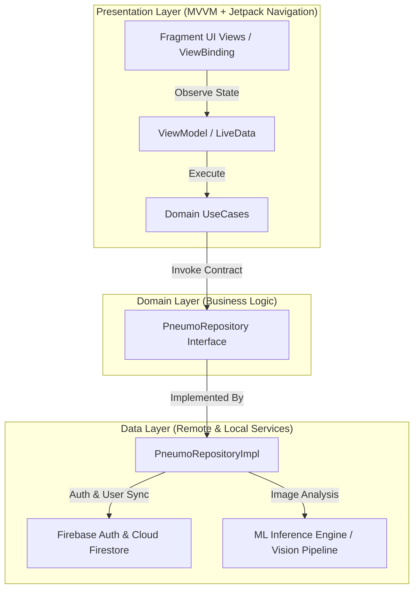

# PneumoScan (AI-Assisted Pneumonia Screening & Kiosk Architecture)

[](https://kotlinlang.org)
[](https://developer.android.com)
[](https://developer.android.com/studio/releases/gradle-plugin)
[](https://dagger.dev/hilt/)
[](https://m3.material.io/)
[](LICENSE)

PneumoScan is a native Android application built with Kotlin, Clean Architecture, and Dagger Hilt dependency injection, designed as a robust architectural foundation for AI-assisted pneumonia screening from chest X-ray radiography.

---

## Clean Architecture Pipeline



---

## Key Features

- **Clean Architecture Separation**: Pure Kotlin domain layer decoupled from presentation and data frameworks for high testability.
- **Dependency Injection**: Full Dagger Hilt integration (`@HiltAndroidApp`, `@AndroidEntryPoint`, `@Inject`) for repository and service bindings.
- **Firebase Authentication & Firestore**: Secure user sign-up, sign-in, and persistent profile state management.
- **Material 3 Design System**: Modern Day/Night themes, dynamic bottom navigation bars, and fluid transitions.
- **Extensible Screening Pipeline**: Modular `AnalyzeImageUseCase` and `TestingViewModel` with camera capture and gallery selection integrations.

---

## Technical Stack

| Component | Library / Framework | Version |
|---|---|---|
| **Language** | Kotlin | 2.0.21 |
| **Build Tooling** | AGP / Gradle | 8.13.0 / 8.13 |
| **SDK Levels** | Compile SDK: 36, Target SDK: 36, Min SDK: 24 | Android 7.0+ |
| **Dependency Injection** | Dagger Hilt + KAPT | 2.57.2 |
| **Cloud Services** | Firebase Auth / Cloud Firestore | 24.0.1 / 26.0.2 |
| **Navigation** | Jetpack Navigation Component | 2.9.5 |
| **UI & Theming** | Material Components 3 + ViewBinding | 1.12.0 |
| **Concurrency** | Kotlin Coroutines | 1.10.2 |

---

## Setup & Local Development

### Prerequisites
- Android Studio Ladybug (2024.2.1+) or newer
- JDK 17 / Java 11 runtime
- Android SDK 36 installed

### Step-by-Step Configuration

1. **Clone the Repository:**
   ```bash
   git clone https://github.com/shayann07/PneumoScan.git
   cd PneumoScan
   ```

2. **Configure Firebase:**
   Copy the example configuration template and insert your Firebase credentials:
   ```bash
   cp app/google-services.json.example app/google-services.json
   ```

3. **Configure Local SDK:**
   ```bash
   cp local.properties.example local.properties
   ```

4. **Build & Run:**
   ```bash
   ./gradlew assembleDebug
   ```

---

## Repository Structure

```
PneumoScan/
├── app/
│   ├── src/main/
│   │   ├── java/com/devsphere/pneumoscan/
│   │   │   ├── di/             # AppModule, NetworkModule, RepositoryModule
│   │   │   ├── domain/         # Entities (Disease, User, TestResult) & UseCases
│   │   │   ├── data/           # Repositories, local stubs, remote API models
│   │   │   ├── presentation/   # Activities, Fragments (Auth, Home, Testing), ViewModels
│   │   │   └── utils/          # Constants, NetworkHelper, Resource wrappers
│   │   ├── res/                # Layouts, navigation graph, themes
│   │   └── AndroidManifest.xml # Camera, Storage & Network permissions
│   ├── google-services.json.example
│   └── build.gradle.kts
├── local.properties.example
├── LICENSE                     # MIT License
└── README.md
```

---

## License

Distributed under the MIT License. See [LICENSE](LICENSE) for more information.

Copyright (c) 2026 **shayann07**
